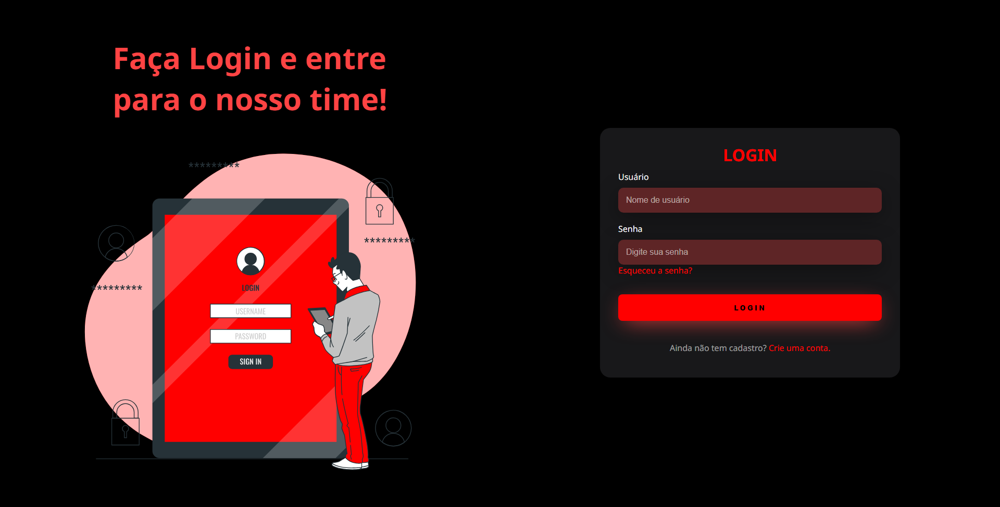
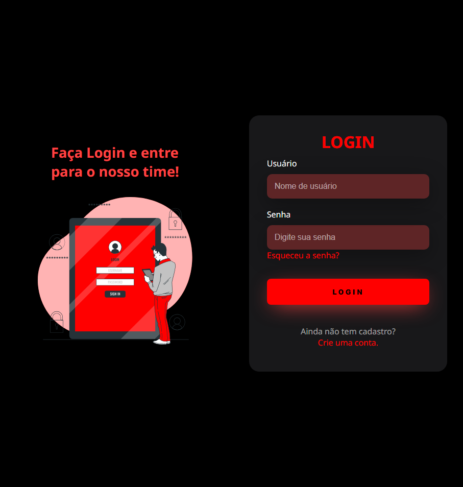
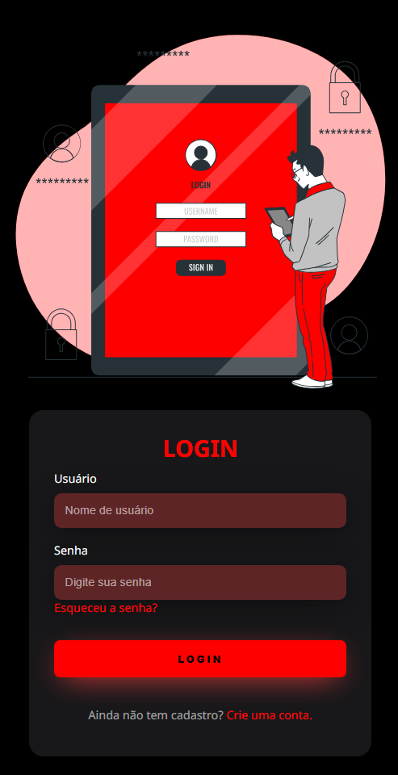

# Tela de login com tema Dark
Nesse código fiz uma tela de login com um tema dark de um site utilizando **HTML e CSS**. 
Tudo com responsividade para **Desktop, Tablet e Mobile**. Tudo isso seguindo uma video-aula do Youtube. Com algumas alterações que eu mesmo fiz, por exemplo: 
- Troquei a imagem principal;
- Troquei as cores principais por cores que gosto mais;
- Fiz o título aparecer no modo Mobile também;
- Adicionei funções para caso a pessoa esquecer a senha ou não tiver cadastro ainda (seguindo outro vídeo de exemplo)
# Modelos:
# Desktop: 
# Tablet: 
# Mobile:  
